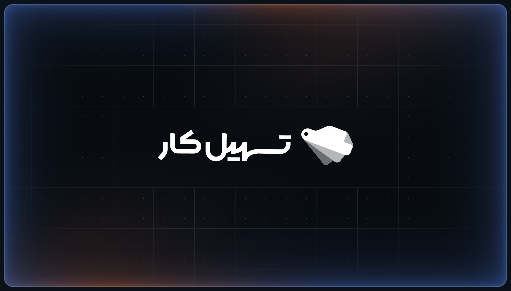

# Tashilcar Docs — Start Here

This is documentation for **AI agents** that help with **Product Design** at Tashilcar
(a car-financing-with-loan company). Files are intentionally **small and single-topic**.
Read this router, then open **only** the file(s) you need.

## How to use these docs

1. Read this page to find the right file.
2. Open the leaf file(s) for your task. Each file's frontmatter (`read_when`) confirms relevance.
3. Follow `related:` links only if needed. **Do not read the whole tree.**

## Always-applies (read for almost any design task)

- [Design foundations](design-system/foundations.md) — RTL, Persian language, Persian numerals, Rial, Jalali calendar.
- [Design principles](design-system/principles.md) — transparency, simplicity, everything tokenized.

## Routing table — "if the task is X, read Y"

| If you need to… | Read |
|---|---|
| Understand the company / financing model | [company/overview.md](company/overview.md) |
| Know who owns what / team roles | [company/team-and-roles.md](company/team-and-roles.md) |
| Look up a domain term | [company/glossary.md](company/glossary.md) |
| Work on a specific product | [products/_index.md](products/_index.md) → product file |
| Understand the design system (Swiss Army) | [design-system/overview.md](design-system/overview.md) |
| Use tokens / per-product colors | [design-system/tokens.md](design-system/tokens.md) |
| Find a component or its Figma node | [design-system/components/_index.md](design-system/components/_index.md) |
| Use a product's custom components | [ui-kits/](ui-kits/) → product kit |
| Follow the design process / handoff | [workflows/_index.md](workflows/_index.md) |
| Read/write a feature spec (by product) | [specs/_index.md](specs/_index.md) |
| Get the data model / entities / statuses (Back-End) | [data/_index.md](data/_index.md) |
| Read an API contract (Back-End) | [api/_index.md](api/_index.md) |
| External services (payments, SMS, inspection) | [integrations/_index.md](integrations/_index.md) |
| Map a component to code / validate it (Front-End) | [design-system/code-connect/_index.md](design-system/code-connect/_index.md) |
| Architecture & decision records | [engineering/_index.md](engineering/_index.md) |
| Find test scenarios / acceptance criteria (Test) | [testing/_index.md](testing/_index.md) |
| Security / sensitive-data handling | [security/_index.md](security/_index.md) |
| Analytics events & funnels | [analytics/_index.md](analytics/_index.md) |
| Release change log | [releases/_index.md](releases/_index.md) |
| Know how an agent should behave | [agents/_index.md](agents/_index.md) |

> **By team:** Product → [specs/](specs/_index.md), [analytics/](analytics/_index.md), [releases/](releases/_index.md) ·
> Back-End → [data/](data/_index.md), [api/](api/_index.md), [integrations/](integrations/_index.md), [security/](security/_index.md) ·
> Front-End → [design-system/code-connect/](design-system/code-connect/_index.md), [engineering/frontend/](engineering/frontend/_index.md) ·
> Test → [testing/](testing/_index.md) · shared → [engineering/adr/](engineering/adr/_index.md).
> See **Team Hand-off** in [ROADMAP.md](ROADMAP.md).

## The 4 products (quick reference)

- **Peykan** — car ads + installment sales website for individual customers.
- **TashilPay** — financial management & installment dashboard for customers.
- **Zamyad** — ad management & inventory dashboard for car dealers.
- **Zhina** — admin dashboard to manage, verify, and review the purchase process.

## Project status

See [ROADMAP.md](ROADMAP.md) for what's written and what's pending.

**Contributing (other teams):** see the **Team Hand-off** section at the bottom of
[ROADMAP.md](ROADMAP.md) for what Product / Front-End / Back-End / Test each own to complete the docs.
